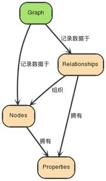

# Neo4j 初认识

Neo4j 是一个高性能、嵌入式、轻量级的，NOSQL 图形数据库。

## 什么是图数据库?

图数据库用图来存储数据，是最接近高性能的一种用于存储数据的数据结构方式之一。让我们跟随下面的图表，用他们来解释图数据库相关概念。我们将跟随图表中箭头方向来读懂图想表达的真正含义。

### 一个图由无数的节点和关系组成

“一张图 – 数据记录在 → 节点 → 包括的 → 属性里面” 最简单的图是单节点的，一个记录，记录了一些属性。一个节点可以从单属性开始，成长为成千上亿，虽然会有一点点麻烦。从某种意义上讲，将数据用关系连接起来分布到不同节点上才是有意义的。

## 参考资料

[Neo4j中文社区](http://neo4j.com.cn)
[Neo4j with Docker](https://neo4j.com/developer/docker/)
[Neo4j Stable Yum Repo](http://yum.neo4j.org/stable/)
俞方桦博士的 `Neo4j Cypher 快速参考`

